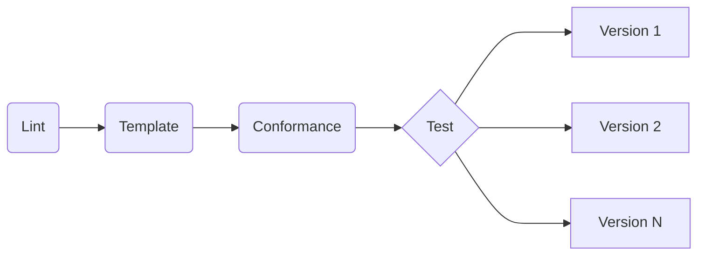

# Kubecost Helm Chart Development Guide

This guide contains tips on setting up a development environment for the Kubecost Helm chart.

> [!IMPORTANT]  
> Following some of these steps may involve billing charges by GitHub for either an individual account or organization.

## Developing with Codespaces and Devcontainers

GitHub includes a feature called [Codespaces](https://github.com/features/codespaces) which allows you to set up an instant, fully-provisioned development environment in the cloud in seconds. This is a containerized environment powered by [Development Containers](https://containers.dev/) ("devcontainers") which have all the necessary project-specific tools to get started.

This repository contains two such devcontainers to aid in easy development, testing, and contribution. The first, which is the default, contains basic tools such as `helm` and `kubectl` along with some other commonly-used tools for Chart development. This default devcontainer will be the one used if no other selection is chosen. Follow the process [here](https://docs.github.com/en/codespaces/developing-in-a-codespace/creating-a-codespace-for-a-repository#creating-a-codespace-for-a-repository) to create a Codespaces environment using the default devcontainer.

The second devcontainer provides a Docker-in-Docker experience allowing you to test/develop your Helm chart changes as well as deploy them to a running cluster all inside the Codespaces environment. In order to create this more advanced Codespaces environment, follow the guide [here](https://docs.github.com/en/codespaces/developing-in-a-codespace/creating-a-codespace-for-a-repository#creating-a-codespace-for-a-repository) at step four and then select the "Cluster" configuration as shown below. You may also wish to use a larger machine type such as the 4-core option if you intend on actually deploying Kubecost.


This Cluster profile includes Docker and Minikube allowing you to not only develop against the Helm chart but also fully deploy, as opposed to just rendering, the Chart to inspect changes. When running Minikube in this devcontainer, pass the `--force` flag to permit Minikube to run as root.

```sh
minikube start --force
```

For more information on GitHub Codespaces, see the reference documentation [here](https://docs.github.com/en/codespaces/overview).

## CI Testing

This repository employs CI checks designed to catch many common issues with Helm charts. These checks must all pass for a PR to be merged as they are designed to prevent regressions and other errors that may impact successful deployment and operation. The workflow `chart.yaml` is responsible for these checks and a graph of what is checked and the order is shown below.



In addition to the default `values.yaml` file required by every chart, this repository also allows testing of additional values files for other configurations of Kubecost. Any values files placed at `/cost-analyzer/ci` will be automatically picked up by this testing process. Values files placed here must conform to the pattern `*-values.yaml` in order to be linted. Changes to any templates will allow testing by all combined values files.

### Linting

Charts and chart values will be linted for YAML syntax and Helm best practices.

### Templating

The chart will be fully templated with each available values file to ensure, given the input values, the templates render correctly.

### Conformance

Once templating is successful, the combined results of the chart templated across all values will be examined for correctness against Kubernetes OpenAPI schemas to ensure the resources are compliant with the latest version.

### Testing

If all previous tests pass, the chart with each of the eligible values files will be deployed across a matrix of the last nine (9) versions of Kubernetes clusters to ensure all expected resources are available, and finally that a basic end-to-end test of the Kubecost deployment is successful. In order for some deployment configurations to succeed, there may be some dependent resources which are required. For example, in some configurations Kubecost requires Kubernetes Secrets to already exist so they may be consumed by Pods in the form of a volume mount. Any such prerequisite resources should be stored in `/.github/ci-files` as they will be automatically deployed as part of the test suite. Files in this directory must not clash and all will be deployed at the outset of testing.
