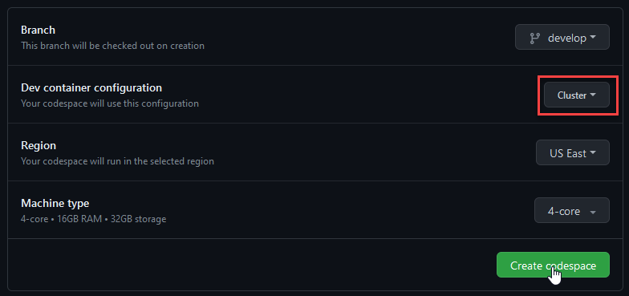
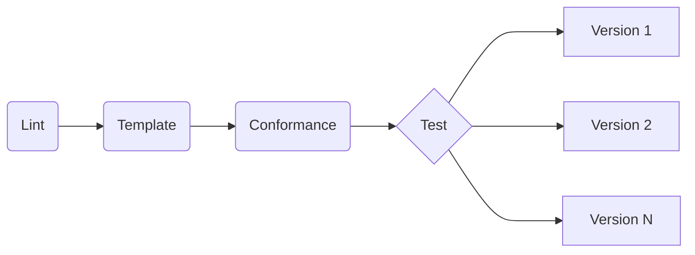

# Kubecost Helm Chart Development Guide<!-- omit in toc -->

- [Sub-chart Dependencies](#sub-chart-dependencies)
- [Developing with Codespaces and Devcontainers](#developing-with-codespaces-and-devcontainers)
- [CI Testing](#ci-testing)
  - [Linting](#linting)
  - [Templating](#templating)
  - [Conformance](#conformance)
  - [Cluster Tests](#cluster-tests)
  - [MCP Subchart Validation](#mcp-subchart-validation)
- [Link Checking](#link-checking)
- [YAML Style Guidelines](#yaml-style-guidelines)
- [Testing](#testing)
  - [How We Test](#how-we-test)
  - [How You Can Test Locally](#how-you-can-test-locally)
  - [Pull Requests](#pull-requests)

This guide contains tips on setting up a development environment for the Kubecost Helm chart.

> [!IMPORTANT]  
> Following some of these steps may involve billing charges by GitHub for either an individual account or organization.

## Sub-chart Dependencies

This chart depends on two sub-charts declared in [`kubecost/Chart.yaml`](kubecost/Chart.yaml):

| Name           | Alias         | Enabled by default           |
| -------------- | ------------- | ---------------------------- |
| `finops-agent` | `finopsagent` | `false`                      |
| `mcp-kubecost` | `mcp`         | follows `aggregator.enabled` |

Install or update all sub-chart dependencies before running `helm template` or `helm install`:

```sh
helm repo add finops-agent-chart https://kubecost.github.io/finops-agent-chart
helm repo add mcp-kubecost https://kubecost.github.io/mcp-kubecost
helm repo update
helm dependency build ./kubecost
```

> **Note:** `helm dependency update` also works but will regenerate `Chart.lock`. Use `helm dependency build` to reproduce the exact pinned versions from `Chart.lock`.

## Developing with Codespaces and Devcontainers

GitHub includes a feature called [Codespaces](https://github.com/features/codespaces) which allows you to set up an instant, fully-provisioned development environment in the cloud in seconds. This is a containerized environment powered by [Development Containers](https://containers.dev/) ("devcontainers") which have all the necessary project-specific tools to get started.

This repository contains two such devcontainers to aid in easy development, testing, and contribution. The first, which is the default, contains basic tools such as `helm` and `kubectl` along with some other commonly-used tools for Chart development. This default devcontainer will be the one used if no other selection is chosen. Follow the process [here](https://docs.github.com/en/codespaces/developing-in-a-codespace/creating-a-codespace-for-a-repository#creating-a-codespace-for-a-repository) to create a Codespaces environment using the default devcontainer.

The second devcontainer provides a Docker-in-Docker experience allowing you to test/develop your Helm chart changes as well as deploy them to a running cluster all inside the Codespaces environment. In order to create this more advanced Codespaces environment, follow the guide [here](https://docs.github.com/en/codespaces/developing-in-a-codespace/creating-a-codespace-for-a-repository#creating-a-codespace-for-a-repository) at step four and then select the "Cluster" configuration as shown below. You may also wish to use a larger machine type such as the 4-core option if you intend on actually deploying Kubecost.



This Cluster profile includes Docker and Minikube allowing you to not only develop against the Helm chart but also fully deploy, as opposed to just rendering, the Chart to inspect changes. When running Minikube in this devcontainer, pass the `--force` flag to permit Minikube to run as root.

```sh
minikube start --force
```

For more information on GitHub Codespaces, see the reference documentation [here](https://docs.github.com/en/codespaces/overview).

## CI Testing

This repository employs CI checks designed to catch many common issues with Helm charts. These checks must all pass for a PR to be merged as they are designed to prevent regressions and other errors that may impact successful deployment and operation. The workflow `test-chart-3.0.yml` is responsible for these checks and a graph of what is checked and the order is shown below.


```mermaid
flowchart LR
    A(Lint) --> B(Template)
    B --> C(Conformance)
    C --> D{Test}
    D ---> E[Version 1]
    D ---> F[Version 2]
    D ---> G[Version N]
```

In addition to the default `values.yaml` file required by every chart, this repository also allows testing of additional values files for other configurations of Kubecost. Any values files placed at `kubecost/ci/` will be automatically picked up by this testing process. Values files placed here must conform to the pattern `*-values.yaml` in order to be linted. Changes to any templates will allow testing by all combined values files.

### Linting

Charts and chart values will be linted for YAML syntax and Helm best practices.

### Templating

The chart will be fully templated with each available values file to ensure, given the input values, the templates render correctly.

### Conformance

Once templating is successful, the combined results of the chart templated across all values will be examined for correctness against Kubernetes OpenAPI schemas to ensure the resources are compliant with the latest version.

### Cluster Tests

If all previous tests pass, the chart with each of the eligible values files will be deployed across a matrix of Kubernetes cluster versions to ensure all expected resources are available, and finally that a basic end-to-end test of the Kubecost deployment is successful. In order for some deployment configurations to succeed, there may be some dependent resources which are required. For example, in some configurations Kubecost requires Kubernetes Secrets to already exist so they may be consumed by Pods in the form of a volume mount. Any such prerequisite resources should be stored in `.github/ci-files` as they will be automatically deployed as part of the test suite. Files in this directory must not clash and all will be deployed at the outset of testing.

### MCP Subchart Validation

A separate workflow (`validate-mcp-subchart.yml`) validates the `mcp-kubecost` subchart integration. It runs on pull requests that touch `Chart.yaml`, `Chart.lock`, `values.yaml`, or the frontend templates, and checks that:

- The subchart dependency is pinned and `Chart.lock` is in sync.
- The subchart follows `aggregator.enabled` unless `mcp.enabled` is set (`mcp.enabled,aggregator.enabled`).
- The expected Kubernetes resources (Deployment, Service, ConfigMap) render correctly.
- The MCP server's `KUBECOST_BASE_URL` targets the correct in-cluster frontend Service.
- The frontend nginx ConfigMap proxies `/mcp` and OAuth paths when the subchart is enabled and omits them when disabled.
- `global.*` values (imageRegistry, imagePullSecrets, additionalLabels, annotations, podAnnotations) are propagated into the subchart.

To run the validation script locally (requires `helm ≥ 3.8` and `yq ≥ 4`):

```sh
helm repo add finops-agent-chart https://kubecost.github.io/finops-agent-chart
helm repo add mcp-kubecost https://kubecost.github.io/mcp-kubecost
helm repo update
helm dependency build ./kubecost
MCP_SUBCHART_SKIP_DEP_BUILD=1 .github/scripts/validate_mcp_subchart.sh kubecost
```

## Link Checking

This repository uses [Lychee](https://github.com/lycheeverse/lychee) to validate links in documentation and configuration files. Link checking runs automatically in CI on pull requests.

```sh
# Install macOS
brew install lychee

# Install Linux
cargo install lychee

# Or, install from release: https://github.com/lycheeverse/lychee/releases

# CI-matching command
lychee --verbose --include-fragments --no-progress --exclude-path '.github-actions' -E './**/*.md' './**/*.yaml' './**/*.yml'

# Single file
lychee --verbose --include-fragments --no-progress kubecost/values-openshift.yaml
```

Notes:

- Excluded links are listed in `.lycheeignore` (example URLs, internal services, etc.)
- Lychee follows redirects automatically and reports the final destination

## YAML Style Guidelines

For the `values.yaml` file, these are the design decisions we make:

- Explicitly define all configurations. Preferably, don't add the configuration as a commented out value.
- All configurations should have a default value, or an empty value defined.
- Comments
  - Only provide comments that provide context beyond the configuration name
  - Use the following headers for regions of configuration:

    ```yaml
    ## Title.
    ## Optional description. Leave line below blank.
    ##
    ```

  - Use `##` for comments that describe a single line of configuration.
  - Use `#` for commented out example values.

For Helm chart templates, these are the design decisions we make:

- Avoid using the [`default`](https://helm.sh/docs/chart_template_guide/functions_and_pipelines/#using-the-default-function) function in templates. Instead, explicitly define the configuration and its default value in the `values.yaml` file.

## Testing

### How We Test

This project uses GitHub Actions for automated testing. Each push and pull request triggers our continuous integration (CI) workflows to ensure code quality and correctness before merging.

**CI Workflows run the following checks automatically:**

- **Link Checking:** Uses [Lychee](https://github.com/lycheeverse/lychee) to validate documentation and configuration file links.
- **Helm Chart Validation:** Runs `helm template` to verify that the chart renders as valid Kubernetes manifests without errors.
- **Linting:** Runs YAML linter and shell scripts to enforce code style and detect errors, if present in repository workflows.
- **Other Static Analysis Tools:** Additional checks may be present depending on repository configuration.

You can view the exact steps and configuration in the `.github/workflows` directory. The most common workflows are:

- `.github/workflows/test-chart-3.0.yml` — lint, template, conformance, and cluster tests
- `.github/workflows/validate-mcp-subchart.yml` — mcp-kubecost subchart integration
- `.github/workflows/link-checker.yaml` — documentation and config link checking

### How You Can Test Locally

Before submitting a pull request, you are encouraged to run the same core tests locally to catch issues early:

**1. Helm Chart Rendering**

```sh
# Remove any existing subcharts
rm -rf ./kubecost/charts

# Ensure both subchart repos are present
helm repo add finops-agent-chart https://kubecost.github.io/finops-agent-chart
helm repo add mcp-kubecost https://kubecost.github.io/mcp-kubecost
helm repo update
helm dependency build ./kubecost

# Render Kubernetes manifests to check for errors
helm template kubecost ./kubecost
```

**2. Link Checking**

```sh
# Follow the Lychee instructions above for validating links locally
```

**3. MCP Subchart Validation**

```sh
MCP_SUBCHART_SKIP_DEP_BUILD=1 .github/scripts/validate_mcp_subchart.sh kubecost
```

**4. Linting & Other Checks**

- If applicable, run `yamllint`, `shellcheck`, or other linting tools required by the CI workflows.

### Pull Requests

All pull requests will be blocked from merging until these automated checks have passed. If a check fails, click "Details" next to the failed status in GitHub to see logs and errors.

If you have questions about any workflow or test, refer to the workflow YAML files or ask a maintainer for help.
